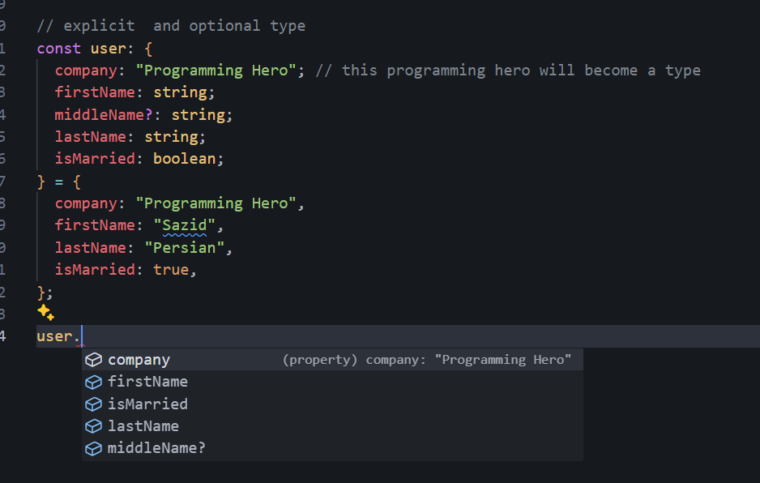

# Basic Types Of Typescript

GitHub Link: [Module-1](https://github.com/Apollo-Level2-Web-Dev/Apollo-Level2-Web-Dev-batch-5-be-a-typescript-technocrat/tree/main/module1)

Are you ready to dive into the world of TypeScript? 🔥

This module introduces the power of TypeScript, a supercharged version of JavaScript that helps you write cleaner, more reliable code. Here's a sneak peek at what you will learn:

1. Intro to the TypeScript Technocrat Mission: We'll kick things off by introducing TypeScript and explaining how it empowers you to become a web development "Technocrat"—someone who builds robust and efficient web applications.

2. Introduction to TypeScript: You'll learn what TypeScript is, why we use it, the benefits of using TypeScript, and how it builds upon your existing JavaScript knowledge.

3. Install typescript and node version manager: We'll guide you through setting up the necessary tools, including how to install TypeScript and introduce you to Node Version Manager.

4. Your First TypeScript Program: Then the exciting part begins! You'll write your first TypeScript program!

5. Mastering Basic Data Types: TypeScript helps you manage different types of data. You'll learn about numbers, strings, Booleans, and other data types that make your code more organized.

6. Object Power, Optional and Literal Types: Explore the world of objects in TypeScript—how to structure them, define optional properties, and even use literal types for greater control.

7. Function in TypeScript: Functions are the building blocks of any program. We'll teach you how to write functions in TypeScript! You'll learn about features like parameter typing and return type definition.

8. Destructuring in TypeScript: Simplify working with complex objects using destructuring—a powerful technique that allows you to extract specific data with ease.

9. Type Aliases in TypeScript: Learn how to create type aliases, which are like nicknames for complex types. This will make your code cleaner, more readable, and easier to maintain.

10. Union and Intersection Types: Imagine being able to define variables that can hold different types of data. That's the power of union and intersection types in TypeScript!

11. Ternary, Optional Chaining & Nullish Coalescing: Discover special operators like ternary operators, optional chaining, and nullish coalescing. These operators make your code more concise and safer to work with.

12. Unveiling Never, Unknown & Nullable Types: TypeScript offers advanced type concepts like "never," "unknown," and nullable types. These advanced concepts give you more flexibility when dealing with unexpected or nullable values.

By conquering these topics, you'll be well on your way to becoming a TypeScript whiz and crafting superior web applications! 💥

## 1-0 Intro To Typescript Technocrat Mission


## 1-1 Introduction To Typescript

### What is Typescript?

- Typescript Is An Object Oriented Programming Language That Is Built On Top Of Javascript With Extra Features.
- Typescript is extended version of javascript loaded with extra features

### Why Typescript?

- Problem of Javascript
  1. Dynamically Typed Language, For this reason we can declare any kind of variable any time, this is a problem, In small scale project we may catch but in large scale project we cant check the type checking error so easily.
  2. In js if we do not go in run time we are not able to catch the error in run time
  3. Js do not support object oriented by default, we use syntactic sugar


- When the situation is like we need to work on a project that should be supported in older version browser, in this situation typescript helps us to choose in which version of js we want to work. Since at the end of the day typescript is converted in javascript and Typescript can be transpiled into older versions o0f javascript


#### Can Browser Recognize Typescript?

- Browser can not run typescript code, at the end of the day we need to transpile Typescript code to javascript code and the js code is run by browser/ node.js

### Benefits Of Typescript?

- Supports older Browser
- Type safety ( we can not declare any type of variable any time this solves the problems of dynamically typed problems of js )
- Js Types in Ts
  1. Number
  2. String
  3. Boolean
  4. Null
  5. Undefined
  6. Object
  7. Symbol
- Ts has its own types including the js types
  1. Interface
  2. Void
  3. Array
  4. Tuple
  5. Enum
  6. Union
  7. Intersection


- Increases Productivity (if we declare any utility function and import any other file we do not need to go to the file and check what types we have to use or what parameter we have to send )
- Less Bug and Less Testing

### Drawbacks Of Typescript?

- Type Complexity : Even its a simple code still we need to declare type
- Limited Library Support : Some libraries do not support typescript
- Over Engineering
- Migration Challenge in converting js to ts

## 1-2 Installation Of Typescript and Fast Node Version Manager

- We need to install node version manager since ts will be converted to js and to run the js in server side we need a run time, we will use node.js as the run time

### Install Node.js

[Node.js-Download](https://nodejs.org/en/download)

- Node.js Installation using command line since it will give us flexibilities switch in different version
  1. write "winget install Schniz.fnm" this command in powershell, this will Download and install fnm
  2. "fnm install 22" write this command to install version 22
  3. "fmn list" this command will show the list of node versions that are provided by fnm
  4. "fnm env --use-on-cd | Out-String | Invoke-Expression" use this command to set the environment
  5. "fnm install 22.15.0" this command to install required version
  6. "fnm use 22.11.0" to switch version

### Install Typescript

- Go to cmd and "npm install -g typescript" . We Are Installing it globally
- To check the version "tsc -v" . Tsc Is a Typescript Compiler which converts ts code to js code

## 1-3 Write Your First Typescript Program

- index.ts

```ts
let course = "Next Level Web Development";
console.log(course);
```

- even if its ts file it will show output if we run "node index.ts" since we have used nothing of ts here

- index.ts

```ts
let course: string = "Next Level Web Development";
console.log(course);
```

- This will show error that node.js can not run the ts code directly
- We need typescript compiler. "tsc index.ts". this will transpile the ts code to js code
- In the folder structure is module1--> src --> index.ts write this command to transpile to js "tsc .\module1\src\index.ts"

- if we open ts and the transpiled js file in same folder and opened it will show an error so we will keep the transpiled files in another folder.

- we need a typescript configuration file fo this we have to write "tsc --init", it will give us tsconfig.json file

- tsconfig.json configuration

```json
"target": "ES5" /* Set the JavaScript language version for emitted JavaScript and include compatible library declarations. */
//  will find out root dir and set the directory where the ts file is
   "rootDir": "./module1/src/",

//  we will find out outDir and set this to tell where the transpiled js code will be stored
    "outDir": "./module1/dist"
```

- After configuration we will just have to write "tsc" to transpile the files to js. we do not need to say the specific file names and folder."tsc" command will convert all the ts files in the folder in src and keep it in dist folder"

## 1-4 Basic Data Types Of Typescript


#### Primitive data Types

1. Number
2. String
3. Boolean
4. Null
5. Undefined
6. symbol

#### Non-Primitive data Types

- In js we just use object in non-primitive since we know array is also a object and object is a object type data.
- But Typescript has gave us specific Array and Object Type data Type.
  1.  Array
  2.  Tuple
  3.  Object
- We will not get the ts data types in run time, we will compile ts to js and use node.js to to run the js
- So? how does ts helps us? It Helps us when we compile the code it will show us the errors related to the types.

### Starting With Primitive Data Types

- 1.4.ts

- Typescript is smart . Even If We Have not gave any type it will infer the data type from our value.
- This is called typescript implicit data types

```ts
//  String
let firstName = "Sazid";
```

- we can also tell the data type explicitly

```ts
let lastName: string = "Sazid";
```

- Number, Boolean, Null, Undefined Data Types

```ts
// Number
let roll: number = 123;

// Boolean

let isAdmin: boolean = true;

//  undefined

let x: undefined = undefined;

// Null

let y: null = null;
```

- If we do not declare and do not assign any value the typescript will infer as any type
- We can keep any type of data ts will not mind

```ts
let d;
d = "Sazid";
d = true;
```

- Basically we should not use any type, if wer use this we will not get the facilities of ts

- We Should Declare Like this

```ts
let p: number;

// p = "123" not assignable
```

### Starting With Non-Primitive Data Types

- Array Types
- Here as well ts will infer that its an array

```ts
let friends = ["rachel", "monica"];
```

- We can explicitly define the types

```ts
let friends: string[] = ["rachel", "monica"];
let eligibleRoleList: number[] = [1, 2, 3, 4, 5];
```

- If we want to push different type of variable it will show error

```ts
let friends: string[] = ["rachel", "monica"];
friends.push(2); // will show error
```

- Tuple type (Tuple can be in pairs like 2,3,4 or any numbers of pairs)
- Tuple is also a special kind of array in which orders are maintained of type of values and the number of values
- Tuple --> array --> order --> type of values

```ts
let coordinates: [number, number] = [1, 2];
```

- What is the facility of Tuple ?
- Without Tuple

```ts
let ageName = [50, "Mr.Sazid"];
// if we want we can chang the value by grabbing the index and add another value in the array as well
ageName[0] = "Mr.Sazid";
//  this is not right
```

- Using Tuple

```ts
let ageName: [number, string, boolean] = [50, "Mr.Sazid", true];

// ageName[0] = "Mr.Sazid";

//  now we cant
```

## 1-5 Object, Optional and Literal Types

- Object is an important data structure of object.
- Implicit Types

```ts
// Reference Type --> Object

//  this is implicit type, this will automatically infer the types
const user = {
  firstName: "Sazid",
  middleName: "Abedin",
  lastName: "Persian",
};
```

- If we want Explicit Types

```ts
// explicit  and optional type
const user: {
  company: string;
  firstName: string;
  // this is for making optional(It maybe string | Undefined ) and which is not made optional is taken as required
  middleName?: string;
  lastName: string;
  isMarried: boolean;
} = {
  company: "Programming Hero",
  firstName: "Sazid",
  lastName: "Persian",
  isMarried: true,
};
```

- If the situation is like we want to keep the company name fixed we will use string literal types

```ts
// explicit  and optional type
const user: {
  company: "Programming Hero"; // this programming hero will become a type
  firstName: string;
  middleName?: string;
  lastName: string;
  isMarried: boolean;
} = {
  company: "Programming Hero", // if we ant to write anything else except the defined literal types it will show type error
  firstName: "Sazid",
  lastName: "Persian",
  isMarried: true,
};
```

- we can access the properties form the object. If we define a object in one file and export we can access any property of the object in any other files like this
  

```ts
// explicit  and optional type
const user: {
  company: "Programming Hero";
  firstName: string;
  middleName?: string;
  lastName: string;
  isMarried: boolean;
} = {
  company: "Programming Hero",
  firstName: "Sazid",
  lastName: "Persian",
  isMarried: true,
};

user.company;
user.firstName;
user.isMarried;
user.lastName;
user.middleName;
```

- Making string literal using readonly method. its also called access modifier

```ts
// explicit  and optional type
const user: {
  // company: "Programming Hero"; // this programming hero will become a type
  //  this type can be made using read only as well
  readonly company: string;
  firstName: string;
  middleName?: string;
  lastName: string;
  isMarried: boolean;
} = {
  company: "Programming Hero", // if we ant to write anything else except the defined literal types it will show type error
  firstName: "Sazid",
  lastName: "Persian",
  isMarried: true,
};

// we can access the properties form the object. If we define a object in one file and export we can access any property of the object in any other files like this

// user.company = "PH"; // cant change because it is made readonly
user.firstName;
user.isMarried;
user.lastName;
user.middleName;
```

## 1-6 Functions In Typescript

- Functions are the building Blocks
- There are two types of functions in js

1. Normal Function
2. Arrow Function

- Normal Function without Ts

```ts
//  Normal Function

function add(num1, num2) {
  return num1 + num2;
}

add(2, true);
```

- Normal Function with Ts

```ts
function add(num1: number, num2: number): number {
  return num1 + num2;
}

add(2, 3);
```

- Arrow Function with Ts

```ts
const addArrow = (num1: number, num2: number): number => num1 + num2;
```

- Setting default value

```ts
function add(num1: number, num2: number = 10): number {
  return num1 + num2;
}

add(2, 3);
```

- when a function is written inside an object it is called method
- object --> function --> method

```ts
const poorUser = {
  name: "Sazid",
  balance: 0,
  // inside object arrow function do not work since we have to use "this" so we are using anonyms normal function
  addBalance(balance: number): string {
    return `My new Balance Is ${this.balance + balance} `;
  },
};
```

- Callback Function Using TS

```ts
const arr: number[] = [1, 2, 3, 4];

const newArray: number[] = arr.map((elem: number): number => elem * elem);
```
